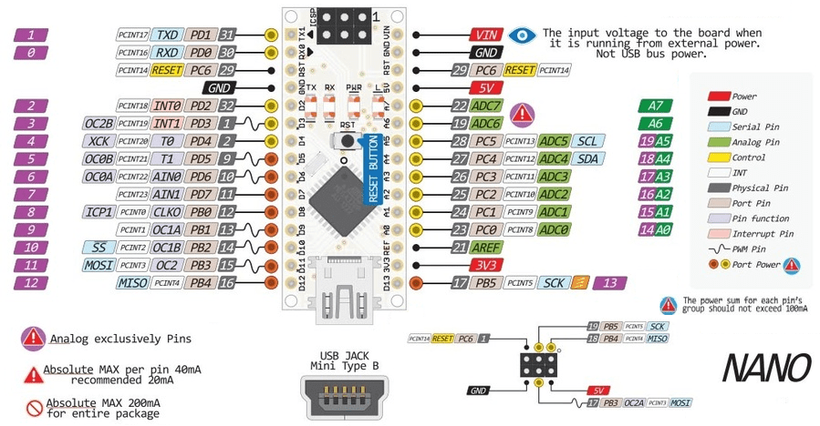

## Send_Serial     
Send serial messages every 2 seconds from Arduino NANO
- - - -

### Same code for:
* [Arduino IDE](./Arduino) &nbsp; &nbsp; &nbsp; and/or 
* [PlatformIO IDE](./PlatformIO)

Go to [Doxygen Project Documentation](https://rcx-t.github.io/Send_Serial/index.html)

SW support:  https://github.com/arduino/ArduinoCore-avr

Arduino NANO board pinout:

[Go To TOP](#TOP)

